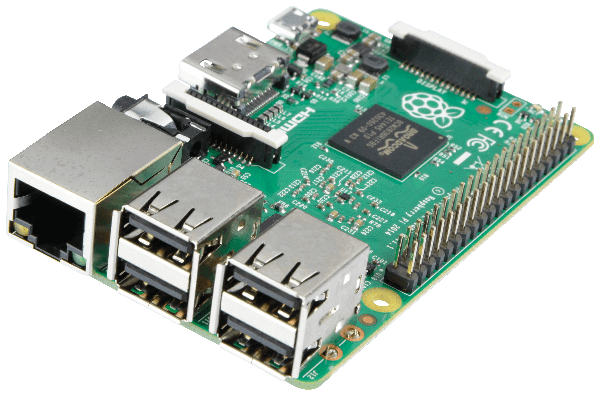
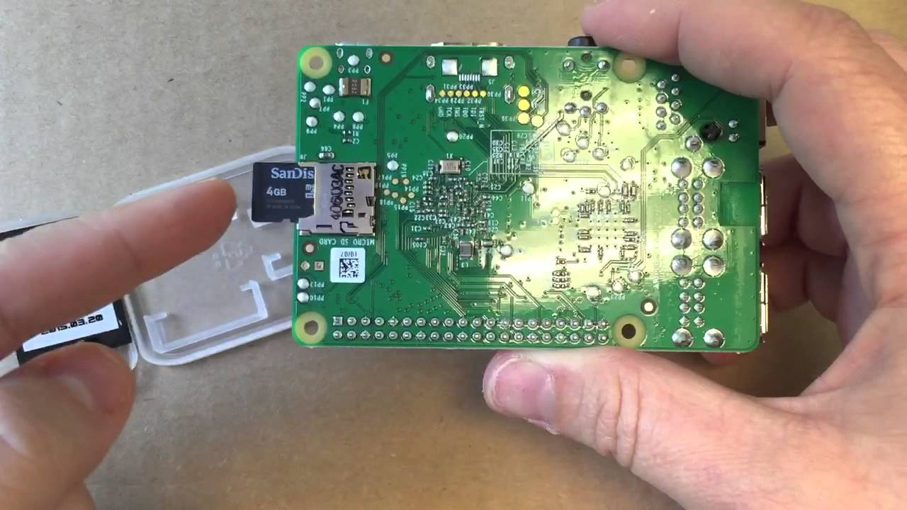
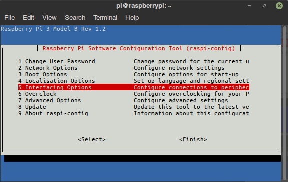
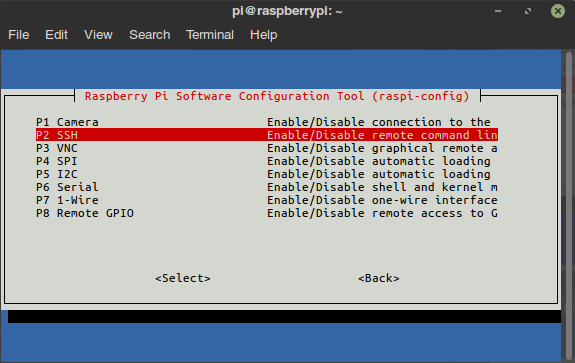
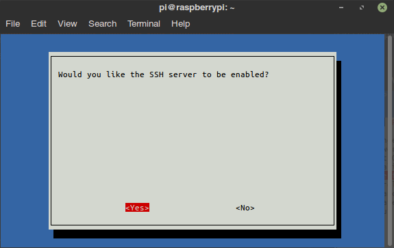
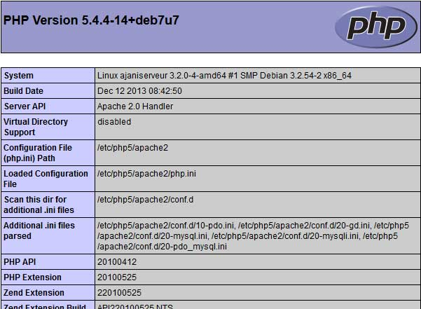

# Penerapan MySQL Database Server Pada Raspberry Pi
  

## Pendahuluan

Jika melihat dari sudut pandang ekonomi, layanan web hosting tidak gratis dan harus membayar setiap bulan/tahun. Berbeda dengan Raspberry yang hanya perlu koneksi serta daya listrik yang rendah. Selain itu, dengan memilih Raspberry, pengguna memiliki kemungkinan untuk memodifikasi sesuai kebutuhan yang di inginkan (ukuran disk, hosting Database, dll.), hal tersebut biasanya tidak dapat dilakukan pada web hosting umumnya.

 Untuk mendukung fleksibilitas lebih, Praktikum ini menggunakan Raspberry Pi 3 Model B, dengan kapasitas 1GB RAM, dibandingkan dengan model Raspberry Pi lainnya yang memiliki spesifikasi lebih rendah. Dan untuk kumpulan software yang akan di install, biasa disebut _LAMP stack_ yang berarti _Linux Apache MySQL PHP_.
#### PHP
Untuk menginstal server web pada Raspberry, pertama Pengguna harus tahu bahwa PHP adalah bahasa pemrograman yang ditafsirkan (_interpreted language_). Dan seperti dalam kasus server, akronim PHP dapat memiliki beberapa arti. Ketika berbicara tentang PHP, berarti berbicara tentang bahasa atau penerjemah(_interpreter_).Di sini, ketika berbicara tentang menginstal PHP, itu berarti akan menginstal _interpreter_, untuk menggunakan bahasa PHP.

PHP (bahasa) biasanya digunakan untuk membuat situs dinamis, artinya bahwa pengguna mengirimkan informasi ke server, setelah itu server mengembalikan hasil yang dimodifikasi sesuai dengan informasi yang diberikan. Sebaliknya, situs statis tidak menyesuaikan dengan informasi yang diberikan oleh pengguna.

PHP itu gratis, dan dikelola oleh Yayasan PHP, serta Zend Enterprise, dan berbagai perusahaan lain (perlu dicatat bahwa Zend juga penulis _zend framework_ yang terkenal, banyak digunakan dan diakui dalam dunia "bisnis") .

Ini adalah salah satu bahasa pemrograman yang paling banyak digunakan, dan bahkan yang paling banyak digunakan untuk pemrograman web, dengan sekitar 79% pangsa pasar.

Semua keterampilan yang dapat diperoleh, pada bahasa, atau pada instalasi dan konfigurasi interpreter, akan selalu berguna. Maka dari itu pengguna disarankan untuk belajar PHP.
#### mysql

_MySQL_ adalah DBMS yang gratis, kuat, dan digunakan secara besar-besaran (sekitar 56% pangsa pasar DBMS gratis).

## Persiapan Hardware


Alat-alat yang diperlukan :  
* Raspberry Pi 3 Model
* Micro SD Card (Min. 8Gb)
* Kabel LAN untuk ke router (bisa menggunakan WLAN, tapi tidak disarankan)
* Keyboard USB
* Monitor
* VGA to HDMI Converter (jika Monitor menggunakan VGA)
* Power Supply Raspberry Pi, DC 5V 2.5A
* Micro SD Card Reader
* Laptop atau PC
* Koneksi Internet


## Instalasi OS

Raspberry Pi wajib menggunakan OS yang mendukung prosesor jenis ARM. Contohnya adalah Raspbian, yang merupakan OS GNU/Linux turunan dari Debian. Untuk membuat server, pilih **Raspbian Stretch Lite** yang disediakan di [situs resmi Raspberry Pi](https://www.raspberrypi.org/downloads/raspbian/).  
File yang berupa kompresi zip, harus diekstrak dari kompresi tersebut hingga berupa satu file *virtual CD* berekstensi "*.iso*".

Sambungkan SD Card dengan komputer untuk menginstall Raspbian kedalam SD Card. Setelah SD Card terdeteksi, gunakan USB Image writer atau software sejenisnya untuk memindahkan isi dari *virtual CD* Raspbian yang sudah didownload sebelumnya. Untuk pengguna Windows atau Linux bisa menggunakan [Etcher](https://etcher.io/) sebagai alat pemindah *virtual CD* ke SD card. Namun, di OS linux biasanya sudah disediakan *tools* sejenis(*USB Image Writer pada Linux Mint*). Lanjutkan dengan menjalankan pemindahan *virtual CD* kedalam SD Card dan OS Raspbian dapat digunakan setelah memasukan SD Card ke Raspberry Pi.

## Booting dan login
Pada saat memulai Raspberry Pi untuk pertama kali, Tampilan dimulai dengan CLI (*Command Line Interface*).
Login dengan ID dan Password bawaan dari raspberry.  
User name `pi`  
Password `raspberry`  
Setelah login, pengguna akan masuk ke dalam shell Debian linux pada raspberry pi.

## Pengaturan SSH
Pengguna sebaiknya mengatur pengaturan raspberry agar bisa di akses melalui terminal dari komputer lain. Tehnik ini biasa disebut *remote login* atau SSH (*Secure Shell*).  
Untuk mengaktifkan SSH server pada Raspberry Pi, ketikkan perintah:  
`sudo raspi-config`  
Akan muncul tampilan menu **Raspberry Pi Software Configuration Tool **.  
Pada menu pilihan **raspi-config**, masuk ke **Interfacing Options**, lalu pilih **SSH**.


  


Pilih `yes` untuk mengaktifkan SSH server pada Raspberry Pi.
  

Selain mengaktifkan SSH server, menu ini bisa juga untuk mengubah password bawaan menjadi pasword yang dikehendaki.

## Remote Login menggunakan ssh
Setelah Network dan SSH diatur dengan benar, maka pengguna bisa mengontrol Raspberry Pi dari perangkat atau komputer lain, sehingga tidak perlu memasang monitor dan keyboard pada Raspberry Pi. Cukup menghidupkan dan memasang kabel LAN, dan Raspberry bisa digunakan melalui SSH.</br>
pada OS Windows, pengguna dapat menggunakan SSH dengan software [Putty](https://www.putty.org/) atau software SSH client lainnya. Namun, pada panduan kali ini, penulis menggunakan OS *Linux Mint* sebagai *remote-client* untuk SSH terhadap Raspberry Pi.

## Apache Web server
setelah memegang alih Raspberry Pi dengan SSH, pengguna dapat menggunakan shell untuk keperluan instalasi Apache dengan mengetikkan:
```
sudo apt update
sudo apt upgrade
sudo apt install apache2
```
Pengguna bisa mengatur hak akses pada folder `/var/www/html` agar memudahkan pengguna dalam mengatur website nantinya. Untuk mengaturnya, ketikan:
```
sudo chown -R pi:www-data /var/www/html/
sudo chmod -R 770 /var/www/html/
```
Pengguna dapat menguji apakah Apache berfungsi dengan benar dengan membuka alamat Raspberry.
Untuk melakukannya, Pengguna perlu mencoba mengakses Raspberry dari port `80`. Dengan cara membuka web browser, dan masuk ke alamat IP LAN raspberry Pengguna. Akan muncul pesan `It Works!` dan banyak teks lainnya pada halaman web browser pengguna.

Jika belum memiliki GUI di Raspbian, atau jika menggunakan SSH untuk terhubung ke Raspberry, pengguna dapat menggunakan perintah berikut:
```
wget -O check_apache.html http://127.0.0.1

```
Perintah diatas akan menyimpan kode HTML dari halaman dalam file "check_apache.html" di direktori saat ini.
Untuk membacanya ketikan perintah:
```
cat ./check_apache.html
```
Jika muncul `It Works!` di dalam kode  berarti Apache telah bekerja dengan semestinya.

Apache menggunakan direktori `/var/www/html` sebagai _root_ untuk situs. Ini berarti bahwa ketika Anda memanggil Raspberry Anda di port 80 (http), Apache mencari file di `/var/www/html`.
Misalnya pengguna menggunakan IP `192.168.0.11` sebagai alamat Raspberry, jika pengguna memanggil alamat `http://192.168.0.11/contoh` pada browser, Apache akan mencari file "contoh" di direktori `/var/www/html`.

Untuk menambahkan file baru, situs, dll, pengguna hanya perlu menambahkannya ke direktori ini.

Pengguna sekarang dapat menggunakan Raspberry untuk membuat situs dalam HTML, CSS, dan JavaScript secara internal. Namun dalam kasus kali ini, pengguna membutuhkan apache sebagai alat untuk menjalankan PHPmyAdmin yang dimana sebagai alat untuk membantu mengolah Database MySQL.

## Instalasi PHP

Lanjutkan dengan mengetikan:
```
sudo apt install PHP PHP-mbstring
```
lalu cek apakah PHP telah jalan.

Pengguna akan terlebih dahulu menghapus file `index.html` di direktori `/var/www/html`.
Kemudian buat file "index.PHP" di direktori ini, dengan mengetikan perintah:
```
echo "<?PHP PHPinfo ();?>" > /var/www/html/index.php
```

Lakukan hal sama dengan pemeriksaan Apache. Pastikan hasil browser mendekati gambar ini:  
  

Jika tidak memiliki antarmuka (_GUI_), gunakan metode SSH yang sama seperti sebelumnya, dan cari kata-kata `PHP Version`

## Database MySQL untuk server

Setelah mengatur PHP, pengguna perlu menyimpan informasi agar dapat digunakan di situs terkait. Untuk hal ini, databaselah yang paling sering digunakan. Maka diperlukan DBMS (Database Management System), yaitu MySQL.

Pengguna memerlukan `mysql-server` dan `PHP-mysql` (yang akan berfungsi sebagai penghubung antara PHP dan mysql). Ketikan perintah:  
```
sudo apt install mysql-server PHP-mysql
```
Pastikan mysql telah jalan.
```
sudo mysql --user=root
```
Setelah itu pengguna akan pindah ke konsol `MariaDB`.
Disini, user _root_ bawaan mysql tidak dihapus dan membuat _root_ mysql yang baru dengan hak akses berbeda, karena default _root_ hanya dapat digunakan dengan akun _root_ Linux, sehingga tidak tersedia untuk skrip webserver dan PHP.

Untuk melakukannya, setelah terhubung ke MySQL, jalankan perintah (ganti kata sandi dengan kata sandi yang diinginkan):
```
DROP USER 'root'@'localhost';
CREATE USER 'root'@'localhost' IDENTIFIED BY 'password_yang_diinginkan';
GRANT ALL PRIVILEGES ON *.* TO 'root'@'localhost'
```
untuk membuka MySQL ke koneksi publik, buat user _root_ publik, gunakan:
```
CREATE USER 'root'@'%' IDENTIFIED BY 'password_yang_diinginkan';
GRANT ALL PRIVILEGES ON *.* TO 'root'@'%'
```
Membuat _root_ ke publik tidak disarankan atas alasan keamanan. Namun boleh digunakan jika untuk keperluan pribadi dan tidak menggunakan data-data yang vital.

Di penggunaan berikutnya, pengguna tidak perlu lagi menggunakan `sudo` untuk mengakses MySQL dengan perintah:
```
mysql --user=root --password=password_yang_telah_dibuat
```

## PHPmyAdmin

PHPmyAdmin adalah fitur opsional namun membantu dalam pengaturan database. Untuk menginstall PHPmyAdmin, ketikan:  
```
sudo apt install PHPmyadmin
```
Program instalasi PHPMyAdmin akan menanyakan beberapa pertanyaan. Tentang bagian `dbconfig-common`, pilih untuk tidak menggunakannya (karena dalam praktek sebelumya telah mengkonfigurasi database). Tentang server untuk mengkonfigurasi PHPMyAdmin, pilih Apache. Dan kata sandi root adalah yang telah diatur sebelumnya untuk MySQL.

Untuk memeriksa apakah PHPMyAdmin berfungsi, akses menggunakan alamat Raspberry, diikuti oleh / PHPmyadmin. Misal, secara lokal akan menjadi `http://127.0.0.1/PHPmyadmin` pada web browser.
